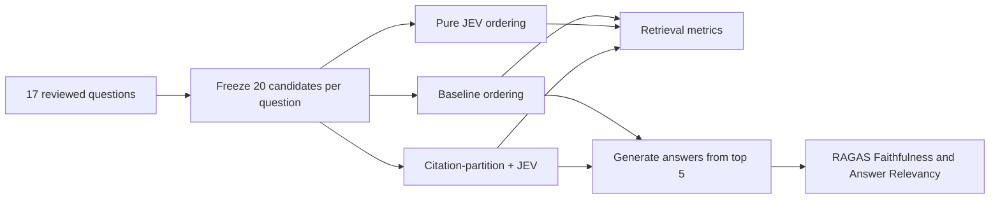

# Methodology

## Experimental flow

## Dataset

- 17 research topics.
- 20 candidates per topic.
- 340 candidate rows in total.
- Stable candidate identifiers.
- Binary relevance labels.
- Identical candidate membership in all three ranking arms.
- Human-reviewed questions for the paired answer evaluation.

## The 17 reviewed questions

| ID | Evaluation question |
|---|---|
| `peft-01` | What update mechanism does RoCoFT use to reduce the number of trainable parameters? |
| `attn-01` | According to the papers provided, what evidence is available about attention mechanism in transformer architectures? |
| `rag-01` | According to the papers provided, what evidence is available about retrieval-augmented generation for large language models? |
| `cnn-01` | According to the papers provided, what evidence is available about convolutional neural networks for image classification? |
| `embed-01` | According to the papers provided, what evidence is available about dense vector embeddings for semantic search? |
| `hybrid-01` | According to the papers provided, what evidence is available about hybrid search combining dense and sparse retrieval methods? |
| `agent-01` | What architectural patterns and challenges do the provided papers describe for enabling LLM agents to use tools reliably and efficiently? |
| `halluc-01` | According to the papers provided, what evidence is available about reducing hallucination in retrieval-augmented generation? |
| `ids-fewshot-01` | According to the papers provided, what evidence is available about few-shot learning approaches for intrusion detection systems? |
| `eval-01` | How do the provided papers evaluate RAG systems, and what strengths or limitations do their evaluation approaches identify? |
| `citegrnd-01` | According to the papers provided, what evidence is available about structural citation grounding in LLM-generated text? |
| `vecdb-01` | According to the papers provided, what evidence is available about approximate nearest neighbor indexing at scale for vector databases? |
| `multiagent-01` | According to the papers provided, what evidence is available about multi-round iterative retrieval in conversational search agents? |
| `hornet-01` | What detection approach does the VespAI system use? |
| `insect-cv-01` | According to the papers provided, what evidence is available about YOLO-based object detection for pollinator and insect monitoring? |
| `insect-class-01` | How do the provided papers approach fine-grained or multi-class visual classification, and what differences in data or model design do they report? |
| `langgraph-01` | What approaches do the provided papers describe for coordinating agent workflows or graph-based control, and where is the available evidence limited? |

## Ranking arms

### Baseline

The frozen current order represented the application's existing citation-partition ranking behavior.

### Pure JEV

JEV scored all 20 candidates for relevance, and candidates were sorted by that score. Stable original rank and candidate ID were used for deterministic tie-breaking.

### Hybrid JEV

Protected citation-partition candidates remained in a leading block. JEV ranked candidates within that block and ranked every non-protected candidate in the remaining block. This preserved an existing invariant while allowing JEV to influence ordering.

## Retrieval metrics

- Precision@5 and Precision@10
- Recall@5 and Recall@10
- nDCG@10
- MRR@10
- Candidate-pool recall as a diagnostic

Metrics were macro-averaged across topics. Paired uncertainty used 10,000 bootstrap resamples. Exact paired sign and sign-flip permutation tests were calculated. Multiple related contrasts were treated as exploratory.

## Paired answer evaluation

For each reviewed question:

1. The baseline top-five contexts produced one answer.
2. The hybrid top-five contexts produced one answer.
3. Prompt, generation model, limits, and evaluation configuration were held constant.
4. RAGAS Faithfulness and Answer Relevancy were calculated.

RAGAS defines Faithfulness as the proportion of answer claims supported by the retrieved context. Answer Relevancy measures how directly the answer aligns with the original question. The experiment used RAGAS 0.3.1, `gpt-4.1` for answer generation, `gpt-4.1-mini` as judge, and `text-embedding-3-small` for embeddings.

Context Precision and Context Recall were excluded because 15 questions did not have reviewed reference answers suitable for those metrics.

## Controls

- Frozen candidate and annotation hashes.
- Pinned JEV model identity: `jev-1.13.0`.
- Exactly one JEV call per topic, with zero retries.
- Atomic checkpoints and resumable capture.
- Sanitized failure accounting.
- No production integration.
- No changing candidate membership between ranking arms.
